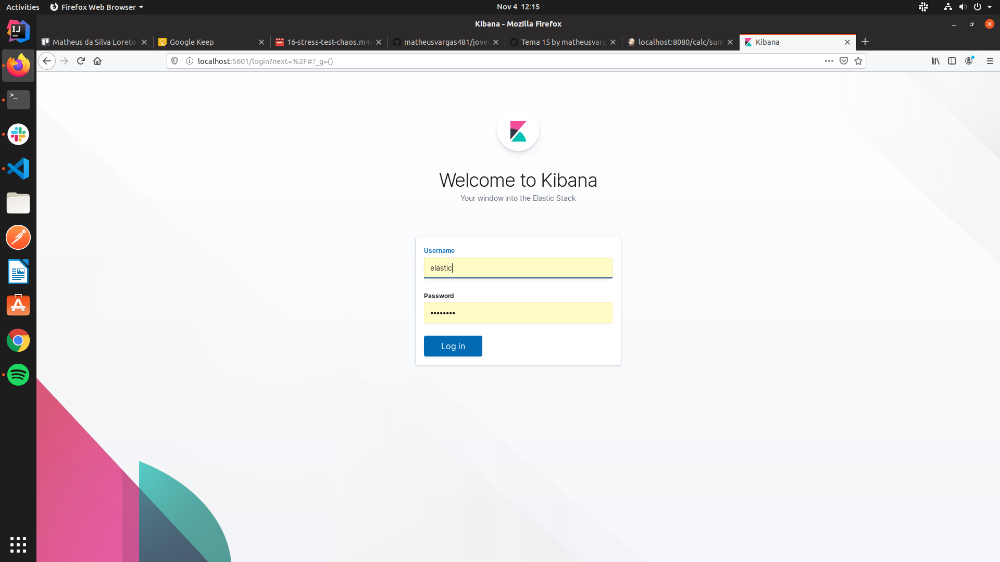
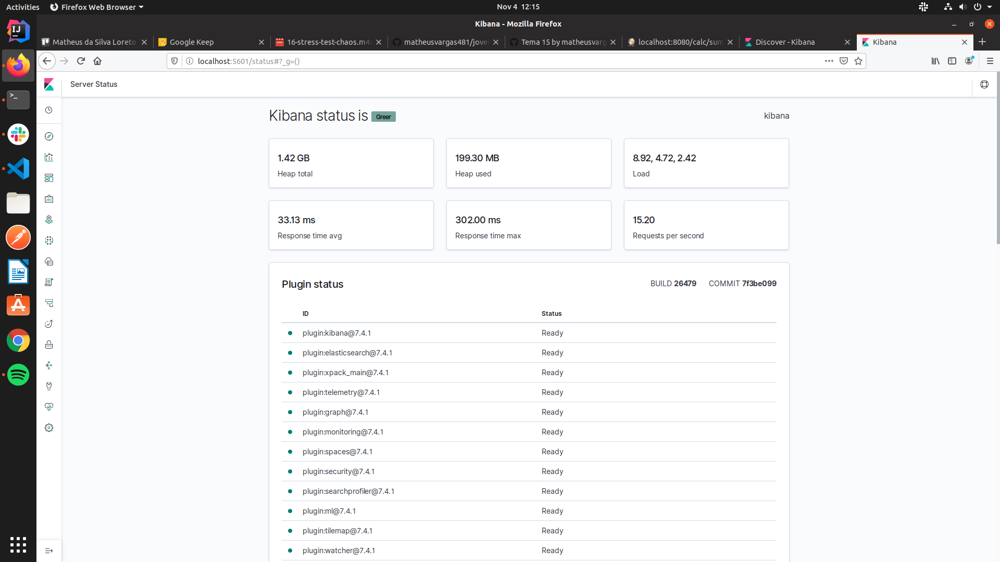
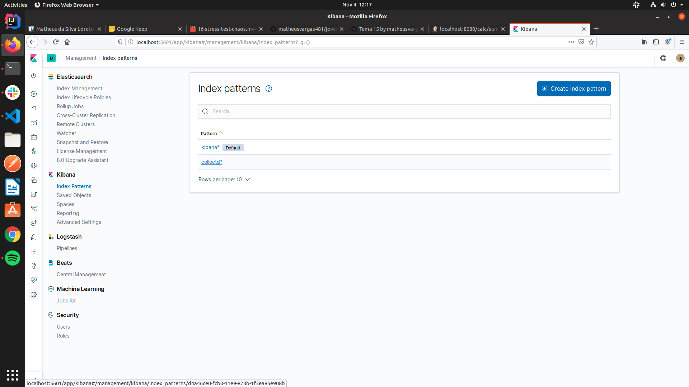
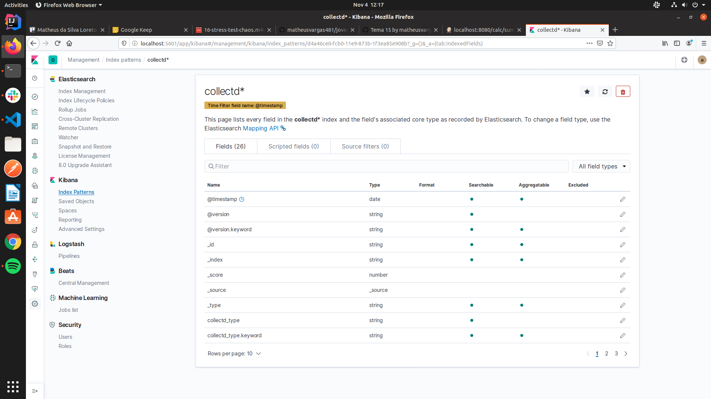
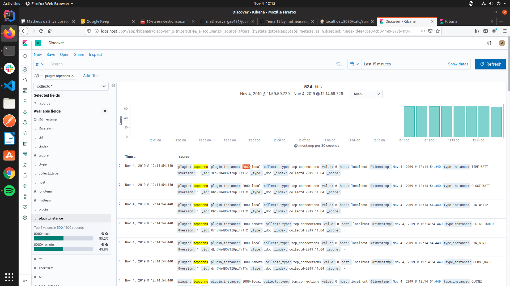
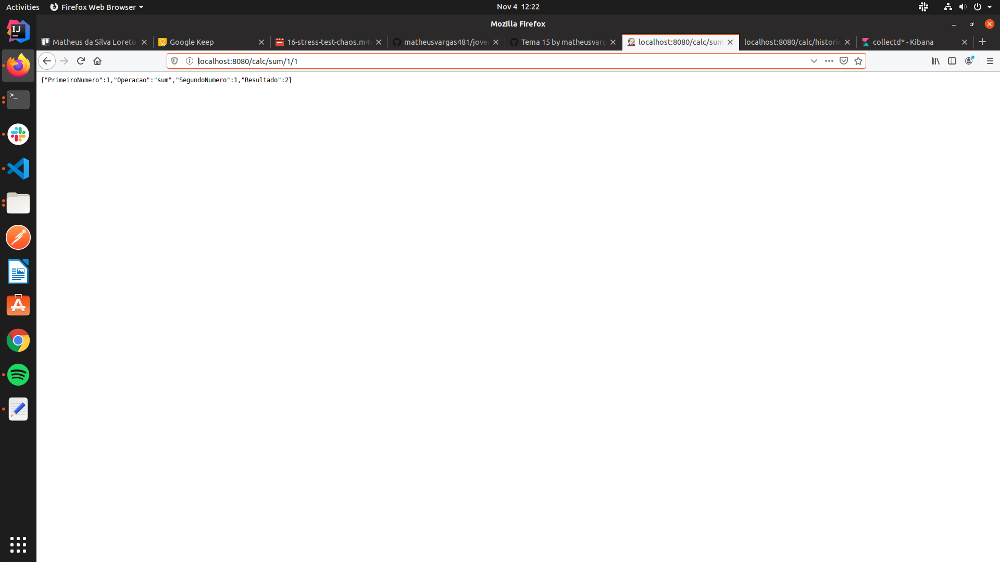
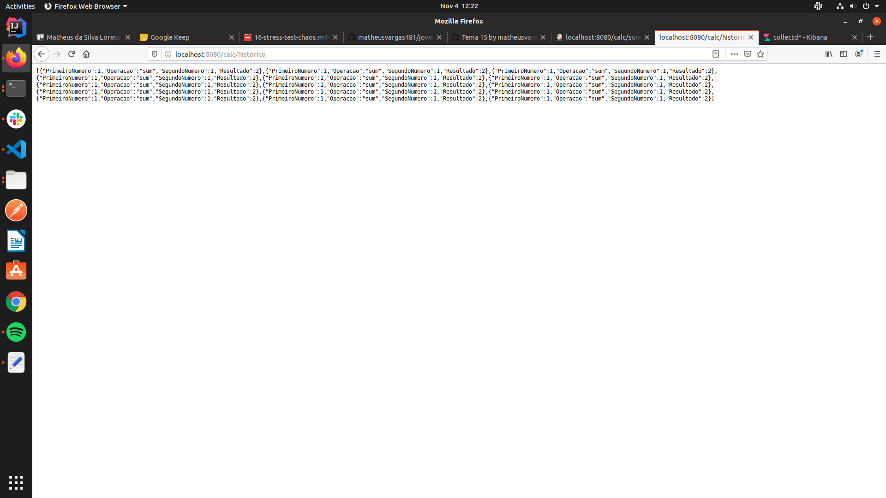

# Telemetry / Observability para Calculadora Go

## Requisitos

  - [Git](https://git-scm.com/)
  - [Docker](https://www.docker.com/)

## Instalação

- Instalando Git:
```
$ apt-get install git
```

- Clone o projeto do github:
```
$ git clone https://github.com/matheusvargas481/jovens-talentos/tree/tema-15/
```

## Configuração

1. Acesse a pasta ~/jts.devops.2019.2/matheus-vargas/Tema-15/ e execute os seguinte comandos para instalação do Docker e Docker Compose.

```
  $ chomd +x config.sh
  $ ./config.sh
```

2. Use o comando abaixo para buildar os containers do ELK Stack e da Calculadora.
```
  $ docker-compose build
```

3. Use o comando abaixo para rodar os containers do ELK Stack e da Calculadora.

```
  $ docker-compose up
```
4. Acesse o endpoint para ter acesso ao Kibana e as métricas com as seguintes credenciais:

```
  Login: elastic | Password: changeme

  $ http://localhost:5061
```
- No Discover, crie um novo index pattern com o pattern criado pelo Collectd;
- Acesse novamente o plugin Discover para visualizar as métricas do contêiner da Calculadora

## Como utilizar a calculadora

1. Você pode fazer cálculos simples como: sum, sub, mul ou div, completando a URL que abrir no browser com:

http://localhost:8080/calc/{operacao}/{PrimeiroNúmero}/{SegundoNúmero}

na {operacao} escolha: sum, sub, mul or div.

Se você quiser conferir o histórico da calculadora, complete com:
http://localhost:8080/calc/historico


## Prints
Login: 
Kibana Status: 
Plugins Pattern Collectd: 
Pattern criado: 
Métricas: 
Aplicação: 
Histórico da Aplicação: 

## Autor

**Matheus da S. L. de Vargas** -  [GitHub](https://github.com/matheusvargas481)
